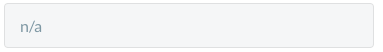

# Components

* [Icon](#icon)
* [Progress Bar](#progress-bar)
* [Search](#search)
* [Button](#button)
* [BackButton](#backbutton)
* [Input](#input)
* [Dropdown](#dropdown)
* [NavLinks](#navlinks)
* [Nav](#nav)
* [Header](#header)

The components used in the page are documented here with some basic information about them:

- Snapshot
- Use example
- Props
- Dependencies

## Icon

> 

```
  <Icon icon={searchIcon} />
```

#### Props

- icon: object,
- className: string,
- theme: object

#### Dependencies

- [react-css-themr](https://github.com/javivelasco/react-css-themr)

## Progress Bar

> 
> 

```
  <ProgressBar progress={50} />
```

#### Props

- progress: number

#### Dependencies

None

## Search

> 

```
<Search
  placeholder="Search something"
  value={searchValue}
  onChange={handleOnChange}
  className={styles.search}
  theme={searchTheme}
  autofocus
/>
```

#### Props

- value: string, // value of the search input
- placeholder: string,
- autofocus: bool, // focus on load
- onChange: func,
- className: string,
- theme: object,
- handleKeyUp: func,
- disabled: bool

#### Dependencies

- [react-css-themr](https://github.com/javivelasco/react-css-themr)

## Button

> 

```
<Button
  onClick={handleClick}
>
  Click me
</Button>
```
> 

```
<Button>I don't have an action</Button>
<Button disabled >
  I wish you could click me
</Button>
```

> 

```
<Button
  onClick={handleClick}
  theme={yellowButtonTheme}
>
  Click me
</Button>
```

> 

```
  <Button
    theme={squareButtonTheme}
    onClick={() => true}
  >
    <Icon theme={blueIconTheme} icon={deleteIcon} />
  </Button>
```

#### Props
- children: node,
- href: string,
- className: oneOfType([string, array]),
- link: string,
- disabled: bool,
- onClick: func,
- theme: object

#### Dependencies

- [redux-first-router-link](https://github.com/faceyspacey/redux-first-router-link)
- [react-css-themr](https://github.com/javivelasco/react-css-themr)

- [Icon](#icon)

## BackButton

> 

```
  <BackButton />
```

#### Props
- className: oneOfType([string, array]),

#### Dependencies

- [redux-first-router-link](https://github.com/faceyspacey/redux-first-router-link)

- [Icon](#icon)
- [Button](#button)


## Input

> 

```
  <Input
    label="Label for CO2"
    unit="CO2"
    inputType="text"
    placeholder="Input some text"
    onChange={(value) => console.log('this is the' + value)}
    onBlur={(value) => console.log('Out of input - this is the' + value)}
  />
```

> 

```
  <Input
    disabled
    label="Label for CO2"
    unit="CO2"
    inputType="text"
    placeholder="Input some text"
    onChange={(value) => console.log('this is the' + value)}
    onBlur={(value) => console.log('Out of input - this is the' + value)}
  />
```

> 

```
  <Input
    notApplicable
    inputType="text"
    onBlur={(value) => console.log('Out of input - this is the' + value)}
  />
```

> 

```
  <Input
    label="Label for number"
    unit="%"
    inputType="number"
    placeholder="Input some number"
    onChange={(value) => console.log('this is the' + value)}
    onBlur={(value) => console.log('Out of input - this is the' + value)}
  />
```
> 

```
  <Input
    label="Label for text area"
    unit="CO2"
    inputType="textarea"
    placeholder="Text Area"
    onChange={(value) => console.log('this is the' + value)}
    onBlur={(value) => console.log('Out of input - this is the' + value)}
  />
```

#### Props

- value: string,
- placeholder: string,
- autofocus: bool,
- onChange: func,
- onBlur: func,
- className: string,
- theme: object,
- handleKeyUp: func,
- inputType: oneOf(['textarea', 'number', 'text']),
- disabled: bool,
- notApplicable: bool, // Grey by default and updates to normal when filled
- label: string, // optional
- unit: string  // optional

#### Dependencies

- [react-css-themr](https://github.com/javivelasco/react-css-themr)
- [lodash/debounce](https://www.npmjs.com/package/lodash.debounce)
- [classnames](https://www.npmjs.com/package/classnames)

## Dropdown

> 

> 

> 

```
<Dropdown
  placeholder="selection"
  options={[
    { label: 'uno', value: 'uno' },
    { label: 'dos', value: 'dos' }
  ]}
  label="select some stuff"
  disabled
/>

```

#### Props
- label: string
- wrapperClassName: string
- className: string
- theme: object
- hasSearch: bool
- disabled: bool
- selectorRef: func

#### Dependencies

- [react-selectize](https://github.com/furqanZafar/react-selectize)
- [react-css-themr](https://github.com/javivelasco/react-css-themr)
- [Icon](#icon)
- [recompose](https://github.com/acdlite/recompose)
- [lodash](https://lodash.com/docs/4.17.5)/sortBy

##### `react-selectize` dependencies (read [this](https://github.com/furqanZafar/react-selectize#peer-deps) for more info)
- react-dom 16.2.0
`npm install react-dom@16.2.0`
(16.3.0 version triggers [this error](https://gist.github.com/jimfb/4faa6cbfb1ef476bd105)).
- react-dom-factories 1.0.2
`npm install react-dom-factories@1.0.2`


## NavLinks

> 

```
  <NavLink routes={routes} />
```

#### Props
- className: string,
- routes: array.isRequired,
- theme: object

#### Dependencies

- [redux-first-router-link](https://github.com/faceyspacey/redux-first-router-link)
- [classnames](https://github.com/JedWatson/classnames)
- [react-css-themr](https://github.com/javivelasco/react-css-themr)

## Nav

> 

```
<Nav/>
```

#### Props
- className: string,
- routes: array.isRequired, // from container
- actions: array  // from container

#### Dependencies

- [classnames](https://github.com/JedWatson/classnames)

- [Icon](#icon)
- [NavLinks](#navlinks)

## Header

> 

```
<Header
  title="Planning"
  routes={this.props.routes}
  actions={
    <div className={styles.actionLayout}>
      ...
    </div>
  }
  backButton
/>
```

#### Props
- backButton: PropTypes.bool,
- title: PropTypes.string.isRequired,
- routes: PropTypes.array, // routes for the navigation tab
- actions: PropTypes.node  // buttons, dropdowns, ... on the right

#### Dependencies

- [classnames](https://github.com/JedWatson/classnames)

- [NavLinks](#navlinks)
- [BackButton](#backbutton)
